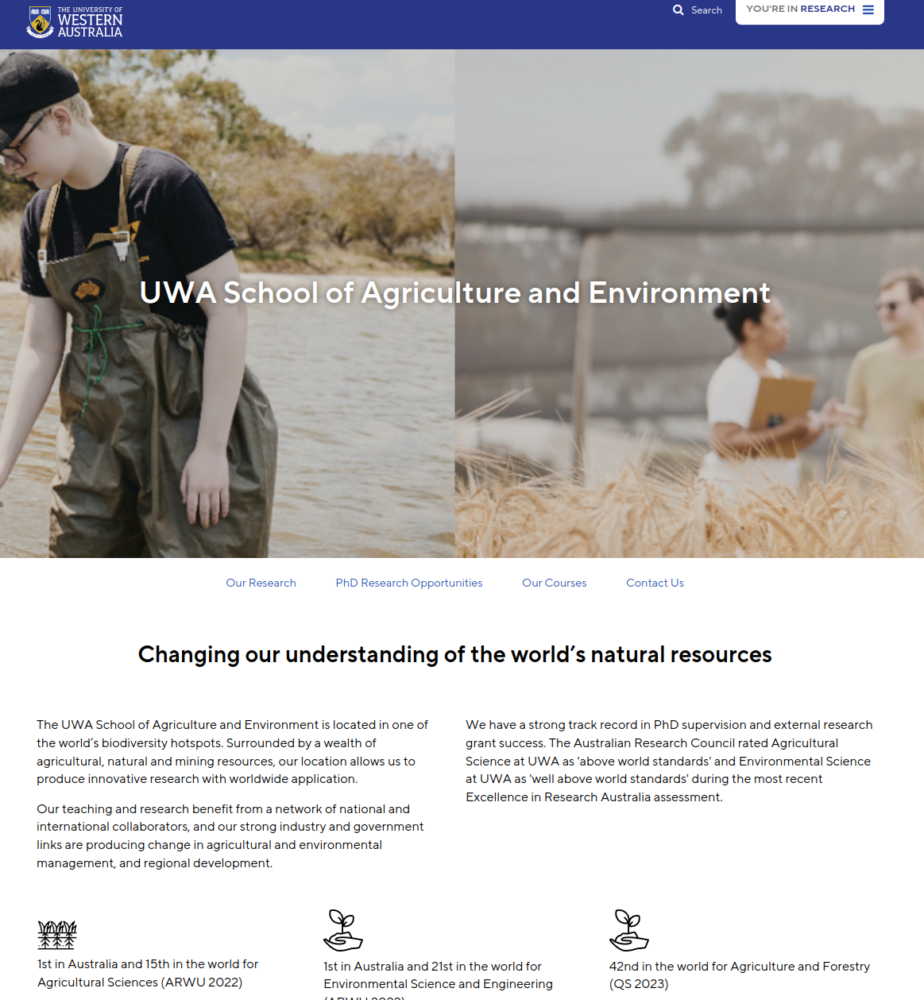
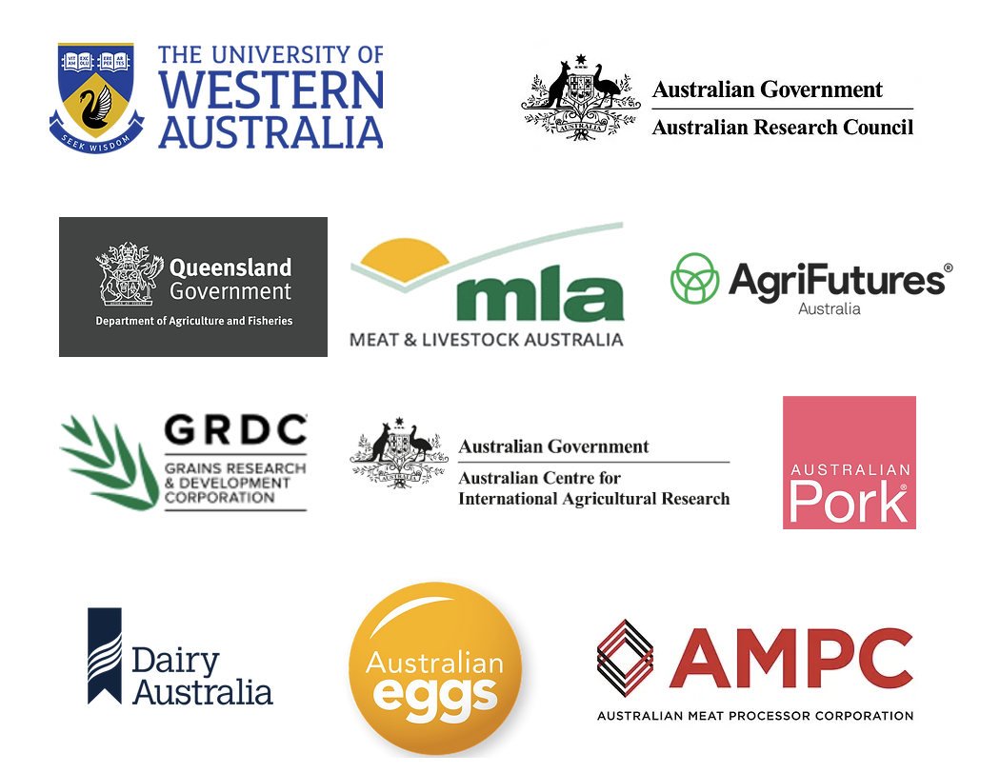
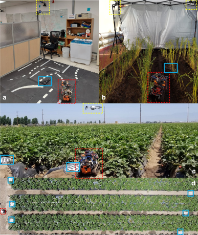
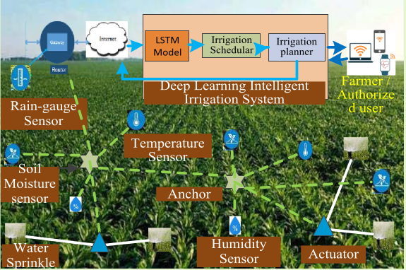
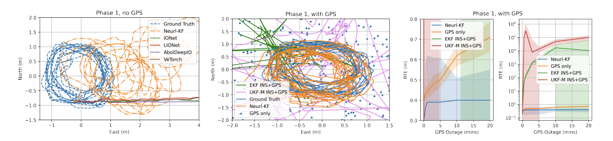
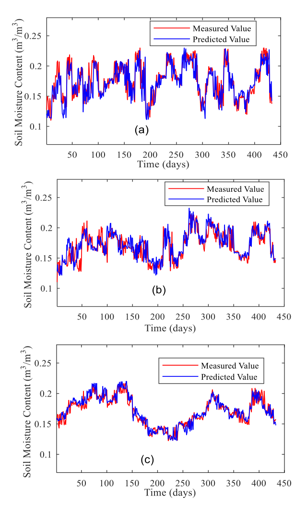
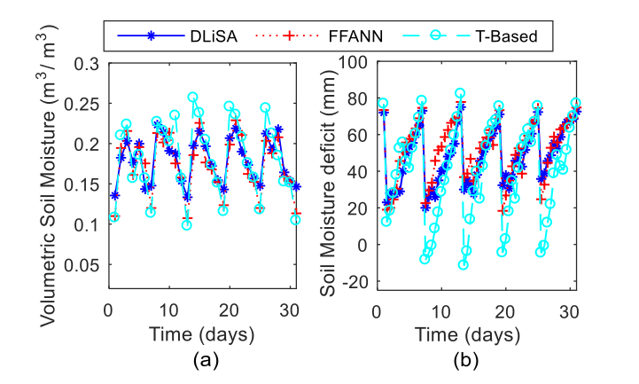

# Agricultural Research

This is the UWA Agricultural Integration Research. This repository combines three key areas of agricultural research: Precio, GNSS, and DLiSA. Our aim is to develop an integrated model that encompasses precision farming, high-resolution navigation, and intelligent irrigation for optimized agricultural operations. This README file serves as a guide for developers and users, providing an overview of the project and its features.

## Precio

Precio is a comprehensive solution designed to assist modern farmers in optimizing their agricultural operations. It is an open-source software tool that enables monitoring, automation, and visualization of farming data. With real-time data analysis and insights, Precio empowers farmers to make informed decisions, improve efficiency, and increase productivity. It is user-friendly and includes third-party integrations to optimize resource usage, reduce waste, and enhance farming practices.

### Integration and Features

Precio offers the following features:

- Real-time monitoring of critical data required for the governance of farming operations.
- Intuitive visualization features for better data analysis and insights.
- Easy integration with third-party tools and devices.
- User-friendly interface for streamlined operations and reduced resource usage.
- Support for following farming practices for greater flexibility:
  - Arable farming
  - Hydroponic farming
  - Horticulture
  - Aquaponics
  - Vertical farming
- Support for actuators and actions for improved efficiency with Telegram integration:
  - Water pumps
  - Water heaters
  - Lights
  - Sprinklers
  - Irrigation systems
  - Ventilation systems
  - CO2 sensors
  - Temperature sensors
  - Humidity sensors
  - pH sensors
  - Water level sensors
  - Water flow sensors
  - Water quality sensors etc.
 

- IoT integration could be implemented by connecting to localhost/api/WMS/{api_token} or localhost/api/PMS/{api_token}

## GNSS

GNSS (Global Navigation Satellite System) plays a crucial role in precision agricultural robots by providing high-resolution navigation solutions. In this project, we introduce a robust neural-inertial sequence learning approach for tracking agricultural robots with intermittent GNSS updates. Our ultra-lightweight neural-Kalman filter achieves superior tracking accuracy, even with limited GNSS updates. Additionally, we provide a user-friendly video-processing toolbox that generates high-resolution position data for fine-tuning pre-trained neural-inertial models. To facilitate research in this field, we also introduce a publicly available neural-inertial navigation dataset for precision agricultural robots.

## DLiSA

DLiSA (Deep Learning-based IoT-enabled Intelligent Irrigation System for Precision Agriculture) addresses the need for water-efficient precision irrigation in unpredictable climates. This solution utilizes a deep learning neural network, specifically a long short-term memory network (LSTM), to predict volumetric soil moisture content, irrigation periods, and spatial water distribution for arable land. By leveraging IoT technologies, DLiSA optimizes irrigation practices, leading to bigger, better, and more profitable yields with fewer resources.

## Requirements

To run the integrated agricultural research project, you will need the following requirements:

- Python 3.8.5 or higher
- Arduino IDE
- Node.js 16.15.4 or higher

### Libraries Used

The project utilizes the following libraries:

- Python: numpy, pandas, tensorflow, keras, uvicorn, fastapi, scikit-learn
- Svelte, vite, svelte-spa-router
- IBM Carbon Design System
- NanoID

### Optional Requirements

In addition to the above, the project may also require hardware support for the following systems:

- PMS (Plant Monitoring System)
- WMS (Weather Monitoring Station)

### Required Items

To set up the project, you will need the following:

- A GPU Workstation running Ubuntu 20.04.
- Python 3.8+ must be installed, preferably through Anaconda or Virtualenv. You can refer to the [Anaconda documentation](https://docs.conda.io/en/latest/) or [Virtualenv documentation](https://virtualenv.pypa.io/en/latest/) for installation instructions.
- Python package requirements are listed in `requirements.txt`. Please install them before running the Python scripts. Note that Tensorflow 2.5.0 is a must. Tensorflow 1.x will not work.
- MATLAB R2020a++ with all toolboxes.

Please ensure that you have the required items and dependencies set up before proceeding with the project.

## Installation

To install the required Python libraries, you can use the following command:

`pip install -r requirements.txt`

Please refer to the individual folders for more specific information and instructions on using each component.

## Experiment Result

## Contact

For any inquiries or feedback regarding this project, please feel free to contact us at 

[22910358@student.uwa.edu.au](mailto:22910358@student.uwa.edu.au)(Yu Liu)

[22672987@student.uwa.edu.au](mailto:22672987@student.uwa.edu.au)(Hanzhe Yang)

[22200099@student.uwa.edu.au](mailto:22200099@student.uwa.edu.au)(Xinyu Wang).

